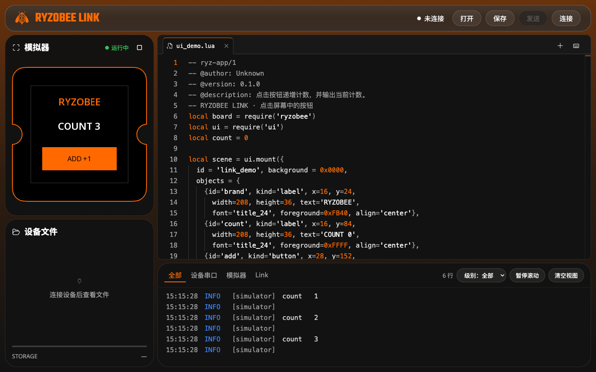
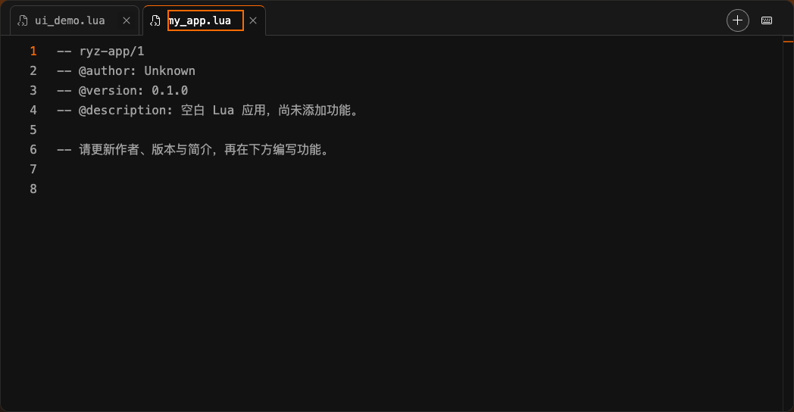
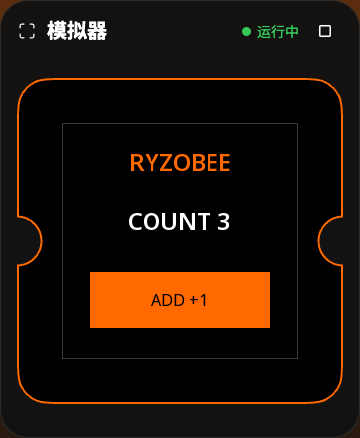
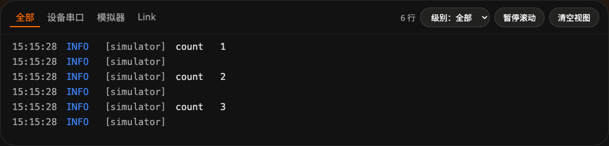

<p align="center">
  <a href="https://wiki.ryzobee.com/zh/home"></a>
</p>

<h1 align="center">RYZOBEE LINK</h1>
<p align="center"><strong>Your browser. Your Lua. Your hardware.</strong></p>
<p align="center">Edit · Simulate · Send · Inspect</p>
<p align="center"><a href="README.md">English</a> · <a href="README.zh-CN.md">简体中文</a></p>
<p align="center"><a href="#quick-start">Quick start</a> · <a href="#screenshots">Screenshots</a> · <a href="#deploy-as-a-static-website">Deploy</a> · <a href="skills/ryzobee-lua/README.md#english">AI skill</a> · <a href="CONTRIBUTING.md">Contribute</a></p>
<p align="center"><a href="LICENSE">MIT licensed</a> · Static web app · Web Serial · Lua + LVGL + WebAssembly</p>

A lightweight Lua workbench for **Ryzobee RootMaker**. Edit scripts, interact with a simulated screen, transfer files over USB serial, and inspect logs—without an application server or desktop installation.



<p align="center"><em>Live browser capture: the included counter after three clicks. No serial device connected.</em></p>

## Highlights

- **No application server:** React, TypeScript and Vite; no account, AI API key or Electron runtime required.
- **Multi-file Lua editor:** Monaco syntax highlighting, adaptive filename tabs, local IndexedDB drafts, file import/export and keyboard shortcuts.
- **Interactive UI simulator:** the pinned Ryzobee C/Lua/LVGL runtime compiled to WebAssembly, isolated in a Worker. Click the simulated display to interact.
- **Web Serial device access:** browse, read, upload, run and delete supported device scripts, with automatic file/capacity updates.
- **Direct device execution:** sending a script does not require simulation, approval tokens or a cloud service. SHA-256 checks transfer integrity, not permission.
- **Useful logs:** Device / Simulator / Link source tabs, level filters and pause/clear controls.
- **Offline after initial loading:** production assets, fonts, editor workers and Wasm are bundled and cached locally.

## Quick start

Use Node.js **22.12+**, npm, and desktop Chrome or Edge for USB serial access.

```sh
git clone https://github.com/Ryzobee/ryzobee-link.git
cd ryzobee-link
npm ci
npm run dev
```

Open **http://127.0.0.1:5180**. The development port is fixed; a busy port causes an error rather than silently selecting another one. Prebuilt simulator assets are checked in, so normal frontend development does not need ESP-IDF or Emscripten.

1. Open a `.lua` file or create a new one. New files include the firmware's `ryz-app/1` metadata header.
2. Click the simulator play icon and interact with its screen. Editing or switching tabs does not replace a running simulation; stop and run again to load the current source.
3. Connect a compatible RootMaker board, click Connect and select its USB serial port.
4. Click Send, review the destination and confirm. Run after sending is checked by default; uncheck it to upload only.

Double-click a device file to read it into the editor; its `…` menu also supports download, run and delete. Overwrite and deletion require confirmation. Stop a running device script before device file reads/writes if required by the firmware.

## Screenshots

### Write with room to think

Keep multiple Lua files open, switch between tabs, and start from the firmware-compatible metadata template. Drafts stay in this browser; export files when you want a backup.



### Click the UI, not a playback timeline

Run the current source, interact with the 240×240 screen and see Lua respond. This is the bundled Wasm UI runtime—not an ESP32 peripheral emulator.

<p align="center"></p>

### Follow the output

Switch between device, simulator and Link logs, filter by level, or pause scrolling while inspecting a message.



These captures use the actual application and its bundled demo, without mocked serial data. The interface is currently Chinese; device access is intended for desktop Chrome / Edge. See [capture notes](docs/screenshots/README.md).

## Deploy as a static website

```sh
npm ci
npm run build
npm run preview
```

Preview at **http://127.0.0.1:4180**. Publish the **contents of `dist/`** to a static host (for example Nginx, GitHub Pages or Cloudflare Pages). No Node.js process or backend is needed in production.

- Serve over **HTTPS**; localhost is also accepted for local development. Web Serial and Service Workers need a secure context and browser support.
- Preserve the generated directory structure, including `sw.js`, fonts, workers and `simulator/`. Serve `.wasm` as `application/wasm` and JavaScript with a valid JavaScript MIME type.
- Vite uses relative asset paths (`base: './'`), allowing deployment under a subdirectory such as `/ryzobee-link/`. Redirect a directory URL to its trailing-slash form.
- Avoid long-lived HTTP caching for `index.html` and `sw.js` (use `Cache-Control: no-cache`) so browsers can discover updates.
- The production app works offline only after its initial complete load and Service Worker cache installation. Close old application tabs and reopen to activate an update. Development mode does not install this cache.
- Opening `index.html` directly using `file://` is not supported.

For GitHub Pages, the [release workflow](.github/workflows/pages.yml) builds and publishes `dist/` when a matching version tag such as `V1.0.0` is pushed. Branch pushes and PRs do not deploy. Each repository (including forks) must enable Pages with **GitHub Actions** and allow version tags in its `github-pages` environment first. See the [deployment and release guide](docs/deployment.md) and [V1.0.0 feature list](docs/releases/V1.0.0.md). A fork's tags, releases and Pages settings are not copied to upstream by a PR.

## Shortcuts and local data

Use `⌘` instead of `Ctrl` on macOS. Hover over controls or press `F1` for shortcut help.

| Shortcut | Action |
| --- | --- |
| Ctrl+O | Open local Lua files |
| Ctrl+S | Export the active file to your computer |
| Ctrl+Enter | Start / stop the simulator |
| Ctrl+Shift+Enter | Open the send confirmation |
| F1 | Show shortcuts |

Drafts are stored in this browser's IndexedDB, not uploaded to a server. Clearing site data deletes them; export important files. Closing a tab in the editor removes that browser draft, not the original computer/device file. Closing the final tab keeps an empty workspace. Leaving the page requests the browser's native confirmation when supported and after user interaction.

## Compatibility and boundaries

- Device firmware must support **`ryz-script-store/1`** at **115200 baud**. Current source limit is **16 KiB**; supported names use a 1–36 character ASCII letter/digit/underscore/hyphen stem and `.lua` extension.
- Release the port from other IDEs/serial monitors first. OS drivers and permissions still apply.
- Disconnecting the browser does not stop a powered device's script. Reconnection does not automatically repeat writes or execution. Ambiguous interrupted writes are reported as unknown, not retried blindly.
- The simulator targets **UI**, not electrical behavior, ESP32 timing, DMA, wireless or peripheral emulation. Unsupported peripheral use is explained in the Link log; raw diagnostics stay out of the simulated screen.
- This tool transfers Lua scripts; it does **not** flash/erase complete device firmware or provide an AI agent.

## Development

### AI coding skill

The standalone [RyzoBee Lua skill](skills/ryzobee-lua/README.md#english) helps an AI assistant author and validate compatible scripts. Its guide covers installation, invocation, firmware prerequisites and the workflow for opening generated files in Link. Copy the complete folder, not only `SKILL.md`. Installing it does not add an AI backend or an upload-validation requirement to Link.

```sh
npm run typecheck
npm test
npm run test:browser
```

Browser tests currently select installed **Google Chrome** (`channel: 'chrome'`); installing Playwright Chromium alone does not provide that channel. Install Chrome on the test machine, or explicitly adapt the local Playwright configuration. Device tests use simulated serial streams and do not replace physical hardware testing.

For Wasm rebuild prerequisites, firmware pinning and dedicated simulator tests, see [simulator/README.md](simulator/README.md). For measured validation and limitations, see [docs/validation.md](docs/validation.md).

```text
src/components/   Editor, simulator, logs and dialogs
src/device/       Serial session, protocol, file operations and ANSI logs
src/simulator/    Worker lifecycle and Wasm messages
src/workspace/    Drafts, templates, shortcuts and workspace state
simulator/        C browser adapter, build configuration and firmware lock
public/           Self-hosted runtime, fonts, brand assets and license texts
tests/            Browser workflows
docs/             Design and validation records
```

## Contributing and licensing

Read [CONTRIBUTING.md](CONTRIBUTING.md) before submitting changes. New commits and PR titles use the documented **emoji + type(scope): summary** format. `main` is updated through pull requests only.

Link's original source is licensed under the [MIT License](LICENSE), consistent with Ryzobee's other code repositories. Third-party code, icons, fonts and runtime components retain their own licenses; see [THIRD_PARTY_NOTICES.md](THIRD_PARTY_NOTICES.md). No trademark rights are granted.
