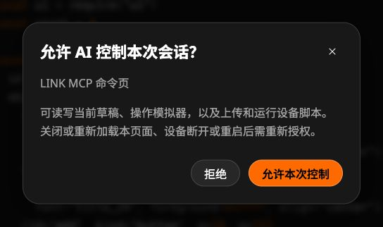
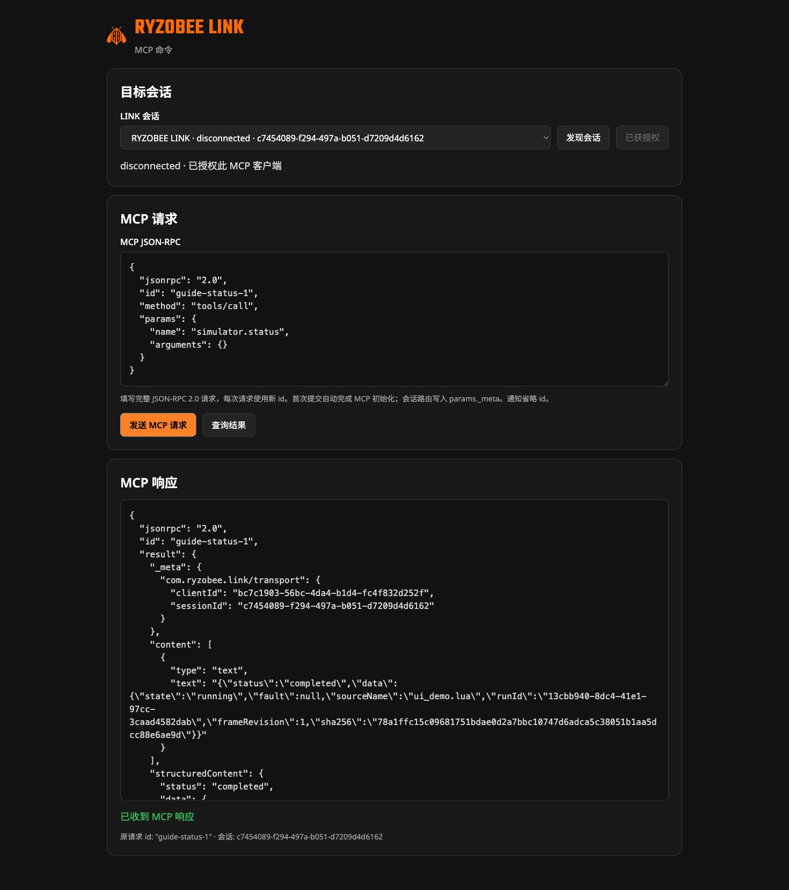
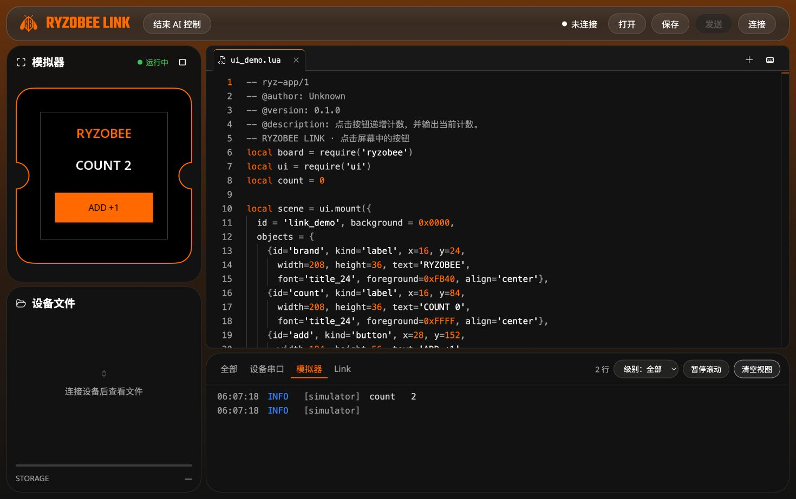

# 让 AI 操作 RYZOBEE LINK

[English](ai-quickstart.en.md) · [返回 README](../README.zh-CN.md) · [MCP 接口参考](agent-commands.md)

你提出任务，AI 操作文件、模拟器和设备；你在熟悉的 Link 页面看代码、画面和日志。**日常使用不需要手写 JSON，也不需要给 Link 配置模型 API key。** 模型与浏览器工具由你使用的 AI 助手提供。

本指南适用于 V1.1.0 及后续兼容版本。以下图片来自 V1.1.0 的真实 Chrome 页面与内置 UI 示例，未连接实体设备。

## 1. 安装 skill，告诉 AI 要做什么

按 [skill 安装说明](../skills/ryzobee-link/README.md#简体中文)复制完整的 `ryzobee-link` 目录，保留 `references/` 和 `agents/`。它负责**操作 Link**；编写 Lua 时可另外安装 `ryzobee-lua`，两者独立。

你的 AI 助手需要浏览器操作能力。可以这样开始：

> 使用 $ryzobee-link 打开 <https://geekheart.github.io/ryzobee-link/>，运行内置计数器，点击两次按钮，检查画面和日志。暂时不要连接或写入设备。

这是本次 fork 体验地址；正式使用时换成你要操作的部署地址。如果助手不能调用浏览器，单独安装 skill 不能补上浏览器能力。

## 2. 让两个页面找到彼此

通常由 AI 在**同一个浏览器配置、同一个站点和部署目录**中打开两个页面：

| 页面 | 你会看到什么 | 本次 fork 示例 |
| --- | --- | --- |
| 用户页 | 编辑器、模拟屏幕、设备文件、日志 | [打开 Link](https://geekheart.github.io/ryzobee-link/) |
| AI 页 | 目标会话、MCP 请求与响应 | [打开 agent.html](https://geekheart.github.io/ryzobee-link/agent.html) |

官方部署对应 `https://ryzobee.github.io/ryzobee-link/` 和同目录的 `agent.html`；请先确认它已发布支持 MCP 的版本。**不要把官方用户页与 fork AI 页混用**，也不要一个用 Chrome、另一个用内嵌浏览器或隐身窗口。

AI 在命令页发现并选定你的会话，再点击「申请授权」。正常用户页没有跳往 AI 页的按钮，这是独立的操作入口。AI 工具支持页面 JavaScript 时，也可以直接操作用户页，无需打开第二页，见[直接接口说明](../skills/ryzobee-link/references/browser-mcp.md)。

## 3. 在用户页允许本次控制

看到下方弹窗，核对这是你刚才委托的助手，再点击「允许本次控制」。不认识的申请应拒绝。



*此授权允许操作当前草稿、模拟器，以及连接后的设备脚本；不会替你选择串口。*

授权后，用户页顶栏出现「结束 AI 控制」，AI 页显示「已获授权」。`disconnected` 表示**设备串口未连接**，不表示 AI 失去授权；只用编辑器和模拟器时无需接板。

这三件事相互独立：

| 状态 | 由谁完成 | 表示什么 |
| --- | --- | --- |
| MCP 初始化 | AI 页自动处理；直接 API 由调用者处理 | 可以发现和调用工具协议 |
| 允许本次控制 | 你在用户页确认 | 该客户端可以操作当前会话 |
| 连接设备 | 你点击连接并在浏览器选择串口 | Link 获得所选设备的串口访问 |

授权不永久保存。用户页关闭或重载、已绑定设备断开或检测到重启后，需要重新允许控制。请只在可信站点上使用。

## 4. AI 发出命令，你看真实结果

AI 先读取当前工具清单和文件，再发送操作。下图是查询 `simulator.status` 的实际请求与响应；请求和响应的 `id` 相同，便于对应。



*这是给 AI 和开发者看的操作界面，不是要求普通用户填写的表单。结果区内部可以滚动查看完整 JSON。*

运行请求返回 `accepted` 只表示已受理。AI 还应查到 `running`、首帧，并结合实际画面或日志确认效果。本例通过 MCP 连续发送两组按下/释放，计数变为 `COUNT 2`，对应日志是 `count 2`：



*顶栏可随时结束 AI 控制；模拟器显示实际运行画面。截图前仅清空了旧日志视图，因此图中保留第二次点击的输出。末尾换行按当前界面规则显示一个空行，并非重复执行。*

模拟器只覆盖 UI，不证明物理外设、无线通信或实机性能。修改源码不会暗中替换正在运行的版本，需再次发出运行操作才加载新源码。

<details>
<summary>开发者：如何复现截图中的命令</summary>

在已经授权的 AI 页发送工具发现请求：

```json
{"jsonrpc":"2.0","id":"guide-tools-1","method":"tools/list","params":{}}
```

读取当前文档，结果在 `result.structuredContent.data`，记下 `id` 和 `sha256`：

```json
{"jsonrpc":"2.0","id":"guide-read-1","method":"tools/call","params":{"name":"workspace.read","arguments":{}}}
```

用刚读到的真实值替换占位符再发送，不能复制截图中的旧 ID/hash：

```json
{"jsonrpc":"2.0","id":"guide-run-1","method":"tools/call","params":{"name":"simulator.run","arguments":{"documentId":"<data.id>","expectedSha256":"<data.sha256>"}}}
```

查询运行状态；触摸、截图和停止使用运行返回的 `runId`，参数以本页 `tools/list` 为准：

```json
{"jsonrpc":"2.0","id":"guide-status-1","method":"tools/call","params":{"name":"simulator.status","arguments":{}}}
```

每次请求换一个新 `id`，包括再次执行本教程。页面按钮会处理初始化；直接调用 AI 页的 JavaScript API 时须先 `await window.ryzobeeLinkAgent.connect(sessionId)`，再调用 `request(sessionId, message)`。

</details>

## 5. 需要上板时，再连接与发送

告诉 AI「把这份文件发送到我的设备并运行」。收到连接提示后，你在**用户页**点击连接，再从浏览器弹窗选择 RootMaker 的串口。设备需要兼容固件，串口不能正被其他 IDE 或监视器占用。

AI 的设备流程是：读取当前草稿和设备文件状态 → 上传 → 查询结果 → 按你的要求运行已保存文件。**不要求先仿真，也没有仿真令牌或再次审核。**

| 操作 | 需要的版本信息 | 操作后意味着什么 |
| --- | --- | --- |
| `workspace.read` | 文档 ID 可省略，默认当前文档 | 返回当前源码的 `data.id` 和 `data.sha256` |
| `device.read` | 设备上的文件名 | 覆盖前获取设备文件的 `data.sha256` |
| `device.upload` | `documentId` = 草稿 ID；`expectedSha256` = 当前草稿 hash；`previousSha256` = 设备旧 hash，新文件用 `""` | 仅保存到设备；确认 `data.state: "committed"` |
| `device.run` | 设备上已保存的 `name` | 启动任务；再用 `device.jobs` 和日志检查运行 |

hash 用于防止传输损坏和误覆盖，不是执行许可。**`device.run` 不会自动上传当前编辑器的修改。** AI 工具的上传与运行分开；普通页面「发送」弹窗中“发送后自动运行”的勾选，不改变 MCP 工具语义。

本指南截图没有连接真机，不作为设备上传或实机验收证据。

## 6. 暂停、结束与故障处理

- **结束 AI 控制**：撤销后续操作权限，不等于停止已经运行的仿真或设备程序。需要停止时，先告诉 AI 停止对应任务，或使用页面停止入口。
- **保留用户页**：AI 页可以放后台；用户页需要保持打开。浏览器可能冻结后台页，关闭全部页面后没有常驻网页代理。持续供电的设备可继续运行已启动的脚本。
- **找不到会话**：先核对两个完整 URL、浏览器配置与存储分区；多个会话要选对目标。不要通过反复发送写入来排查。
- **超时或结果未知**：AI 页等待 15 秒超时，并不证明操作失败，也不会自动取消操作。用新 RPC ID 查询原操作 ID，再检查文件 hash、任务或仿真状态；不直接重发写入/运行。
- **`SOURCE_CHANGED`**：源码在读取后被修改。重新读取并保留用户改动，不用旧 hash 强行覆盖。
- **`NOT_SEEN` / 结果被淘汰**：没有可恢复记录，不等于设备未执行；查实际状态。授权/控制查询工具自身不保留操作历史。
- **“填入 MCP 地址”不能连接**：此静态 URL 不是 Streamable HTTP MCP 服务。使用本 skill 配合浏览器工具，或实现[浏览器传输适配](agent-commands.md#browser-transport-binding--浏览器传输约定)。

进一步阅读：[安装 skill](../skills/ryzobee-link/README.md#简体中文) · [工具与错误格式](agent-commands.md) · [部署与版本更新](deployment.md) · [截图来源](screenshots/README.md)
